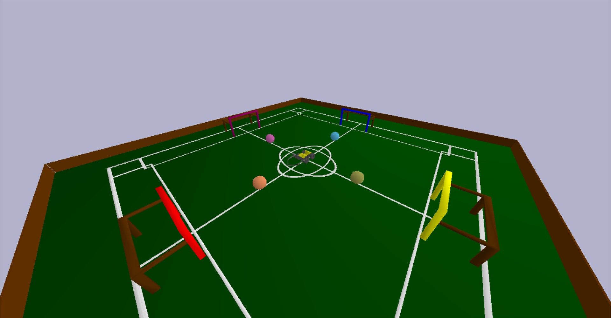
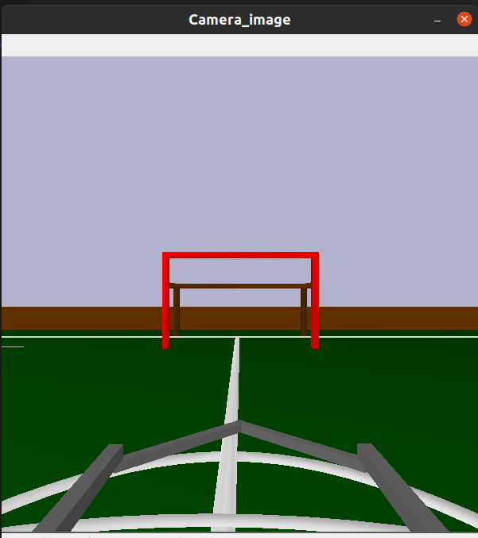

  
  <i>presents:</i>  

# La-Robo-Liga (PS2)

### Welcome to the second problem statement of La-Robo-Liga 2022.   
We are glad that you made it here and hope to see you cruise through the task.  
This repository holds the **official arena for the event** which will be used for evaluation of the submissions by the participants.

## Installation Guidelines  
1. We recommend creating a virtual environment specific to this project. This will help in package management and for decluttering your workspace. An easy way to do so is by entering command:

   ~~~bash
   python3 -m venv <Env_Name>
   ~~~

   Activation and deactivation of your virtual environment, will be done as specified [here](https://docs.python.org/3/library/venv.html). Scroll down to the table where the activation method for various operating systems is provided. Deactivation, in most cases, can be done by simply typing deactivate while being in in the virtual environment.

2. Once you activate your virtual environment, you will have to install the various dependencies of this project. We have simplified this process for you. Just follow the following steps:
   * Download/Clone this repository on to your local machine.
   * Navigate to the root folder of this repository through your terminal.
   * Execute the following command in your terminal.

      ~~~bash
      pip install -e LRL-main-arena
      ~~~

   * To check whether the installation has been successful, you can refer to our guide/cheatsheet to know how to build the gym in your own python script as well as use the utility functions.

In case there are problems with the PyBullet installation, you can refer to this [guide](https://github.com/Robotics-Club-IIT-BHU/Robo-Summer-Camp-20/blob/master/Part1/Subpart%201/README.md).

## Getting started
1. first of all , you'll have to import the package LRL-main-arena, this can only be done if you have performed the step 1 in Installation guidelines properly. 
   Then the arena can be loaded with the following line of code:

~~~python
env = gym.make("la_robo_liga_arena-v0")
~~~
2. Second, you'll need to make the working loop, for continuous simulation in pybullet.

3. There are a few helper functions which we have made for you to interact with the environment. Brief description of each is given below. There is also a folder with example scripts, do check it out to get more information. 
   
   * `env.get_camera_image()`  
      This will return an RGB image from the camera placed in front of the bot husky just above the gripper origin.  
      
   * `env.move_husky()`  
      This is used to control the velocity of each wheel of husky individually.
      
   * `env.open_husky_gripper()`  
      This will be used to open the gripper arms of husky.
      
   * `env.close_husky_gripper()`  
      This will be used to close the gripper arms of husky.
      
   * `env.reset_arena()`
      This will reset the whole arena. **This function cannot be used for your final submission.** 

You can refer the file **helper.py** to see the documentation for different functions      

### Moment of Truth
If you have done everything right, you should be able to see something like this after launching any of the provided scripts.

  
 <i>Ladies and gentlemen, I present to you... La Robo Liga!</i>

## The Task 
You have to make the bot husky go to each ball, open the gripper, close the gripper with the ball between the gripper arms, go to the goalpost of the same color as that of the ball which you have gripped and put the ball inside the goalpost. The task is over as soon as the last ball is inside the goalpost
and outside the gripper.
## A Sample Camera Image

  
 <i>Husky's Eye</i>

  

## Made and maintained by
<table>
 <td align="center">
      <a href="https://github.com/astitva22">
      
       <b> Astitva Gupta </b></a> 
 </td>
 <td align="center">
      <a href="https://github.com/san2130">
      
       <b> Sandeepan Ghosh </b></a> 
 </td>
  <td align="center">
      <a href="https://github.com/naksh2004">
      
       <b> Nakshatra Bansal </b></a> 
 </td>
</table>
